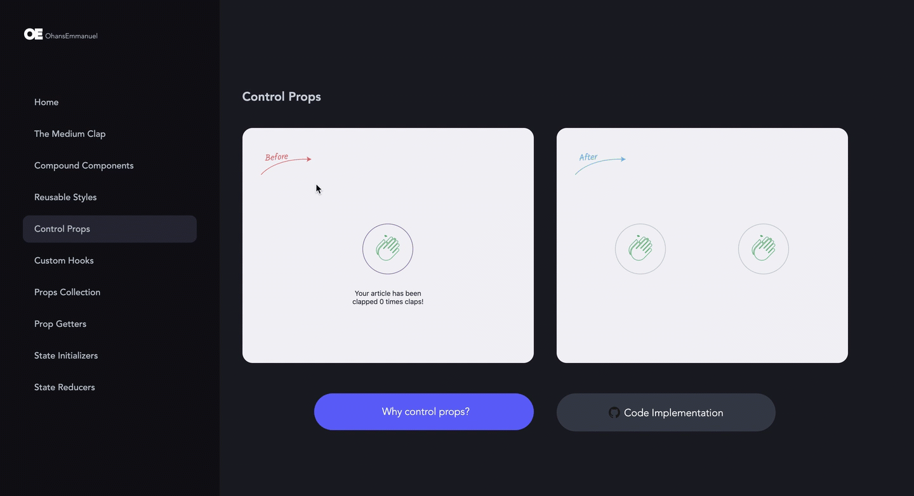

**Welcome to Medium Clap React clone using advanced design patterns!**

Here, you'll be walked through advanced React Component Patterns in an intuitive fashion that models your day-to-day job as a Software Engineer - Pull requests!



## How do I run the demos locally?

1. Clone this repo

```sh
git clone git@github.com:EduGomes18/medium-clap-clone.git
```

2. Change directory

```sh
cd showcase
```

3. Install dependencies

```sh
npm install
```

or

```sh
yarn install
```

4. Run the app

```sh
npm dev
```

or

```sh
yarn dev
```

## The Patterns implemented (PRs)

### 1. The Medium Clap

- [Initial implementation with class component](https://github.com/ohansemmanuel/advanced-react-patterns-ultrasimplified/pull/1)
- [Refactor to custom hooks](https://github.com/ohansemmanuel/advanced-react-patterns-ultrasimplified/pull/16)

### 2. Compound Components

- [Initial implementation](https://github.com/ohansemmanuel/advanced-react-patterns-ultrasimplified/pull/17)
- [With Callback](https://github.com/ohansemmanuel/advanced-react-patterns-ultrasimplified/pull/18/)

### 3. [Reusable Styles](https://github.com/ohansemmanuel/advanced-react-patterns-ultrasimplified/pull/19)

### 4. [Control Props](https://github.com/ohansemmanuel/advanced-react-patterns-ultrasimplified/pull/21)

### 5. [Custom Hooks](https://github.com/ohansemmanuel/advanced-react-patterns-ultrasimplified/pull/7)

### 6. [Props Collection](https://github.com/ohansemmanuel/advanced-react-patterns-ultrasimplified/pull/8)

### 7. [Prop Getters](https://github.com/ohansemmanuel/advanced-react-patterns-ultrasimplified/pull/9)

### 8. [State Initializers](https://github.com/ohansemmanuel/advanced-react-patterns-ultrasimplified/pull/10)

### 9. [State Reducers](https://github.com/ohansemmanuel/advanced-react-patterns-ultrasimplified/pull/12)

- [Initial refactor to useReducer](https://github.com/ohansemmanuel/advanced-react-patterns-ultrasimplified/pull/12)
- [With user defined reducer](https://github.com/ohansemmanuel/advanced-react-patterns-ultrasimplified/pull/13)
- [With type and reducer export](https://github.com/ohansemmanuel/advanced-react-patterns-ultrasimplified/pull/14)

---
